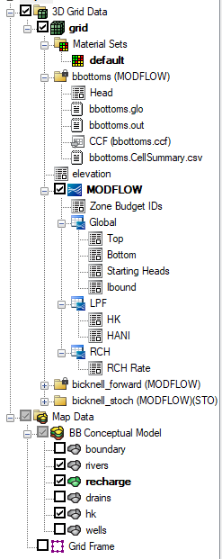

# Data Explorer Overhaul

On the left side of the app we have UI that lists regions with a toggle for each. As you click a region, a list of aquifers appears. Clicking an aquifer will show you the data for that aquifer. This is a very clunky UI and we want to overhaul it.

## New UI - Hierarchical Tree

Refactor the sidebar into a unified hierarchical tree. The top level will be the region, then the aquifer, then the data. No separate section headers — just the tree. Here is an example of this kind of UI from a different app:

Rather than dashed lines like GMS, we will use a modern approach: indentation + subtle background shading per level to indicate hierarchy. Expand/collapse icons will use chevrons (▸/▾) from lucide-react, matching the existing codebase conventions.

Each tree item will have a small icon (12-14px) to visually distinguish its type — specific icons TBD, but color-coded per level (blue for regions, indigo for aquifers, emerald for rasters) to match the existing color scheme.

## Levels

### 1. Region

List of regions at the top level of the tree. Each region has:
- A chevron to manually expand/collapse without selecting
- A small type icon
- The region name (clickable to select)
- A visibility checkbox (independent of selection)
- A kebab menu (⋮) shown on hover — Edit, Download, Delete

**Selection behavior:**
- Clicking a region selects it and auto-expands to show its aquifers
- Selecting a region automatically makes it visible on the map if it wasn't already
- Clicking a different region auto-collapses the previously selected region and expands the new one (accordion-style)
- Manually expanding via the chevron does NOT select/activate the region — just reveals children
- If a region has no aquifers, no expand chevron is shown

### 2. Aquifer

List of aquifers for the parent region, indented one level. Each aquifer has:
- A chevron to manually expand/collapse
- A small type icon
- The aquifer name (clickable to select)
- A kebab menu (⋮) shown on hover — Rename, Delete

**Selection behavior:**
- Clicking an aquifer selects it and auto-expands to show its data
- Clicking a different aquifer auto-collapses the previous one and expands the new one
- When an aquifer is selected, the last-active raster for that aquifer is automatically shown on the map (remembered per aquifer via a `Map<aquiferId, rasterCode>` in state). If no previous selection, the first raster is shown.
- If an aquifer has no rasters, no expand chevron is shown

### 3. Data (Rasters)

List of rasters for the parent aquifer, indented two levels. Each raster has:
- A small type icon (color indicates active/compare/inactive state)
- The raster title
- A kebab menu (⋮) shown on hover — Rename, Get Info, Delete

**Selection behavior:**
- Clicking an inactive raster loads it on the map and deactivates the previous one
- Clicking the active raster unloads it
- Shift-clicking a raster (when one is already active) toggles it into/out of compare mode. Multiple rasters can be in compare mode simultaneously, but only one is the "primary" active raster.
- A loading spinner is shown while a raster is loading

## Styling

- More compact than the current UI — smaller fonts, less padding
- Consistent colors and styling with the rest of the app
- Indentation per level with subtle background shading to reinforce hierarchy
- Kebab menus appear on hover to keep rows clean
- Active raster: emerald styling. Compare raster: blue styling. Inactive: muted/slate.

## Context Menus

Each item type has a kebab menu (⋮) shown on hover:
- **Region:** Edit, Download, Delete
- **Aquifer:** Rename, Delete
- **Raster:** Rename, Get Info, Delete

## State Changes

- **New state:** `lastActiveRasterByAquifer: Map<string, string>` — remembers the last-active raster code per aquifer, so re-selecting an aquifer restores its previous raster
- **Removed:** Separate "Regions" and "Aquifers" section headers

## Keyboard Navigation

Support arrow-key navigation for the tree:
- **Up/Down:** Move focus between visible tree items
- **Left:** Collapse the focused item (or move to parent if already collapsed)
- **Right:** Expand the focused item (or move to first child if already expanded)
- **Enter/Space:** Select/activate the focused item
