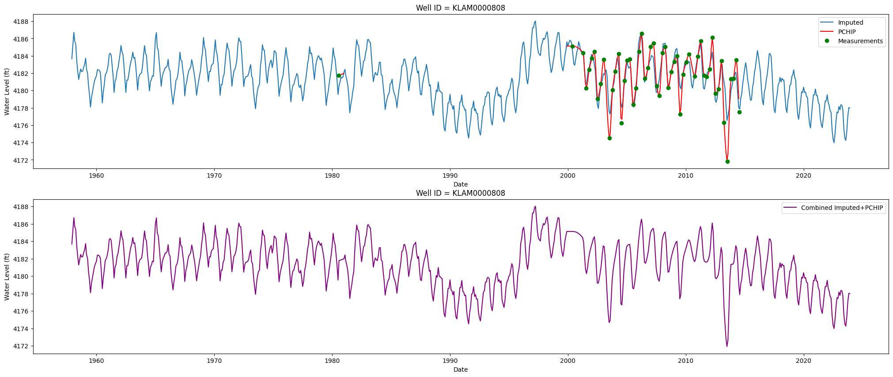

# Imputation of Gaps in WTE Data

When performing spatial analysis, we first temporally interpolation the WTE data using linear, PCHIP, or moving average interpolation. Then, we spatially interpolate the WTE data using inverse distance weighting (IDW) or ordinary kriging (OK). The problem with this approach is that you may have a time series for a well that only covers a portion of the time period of interest. For example, you may have a well that only has data for the first 10 years of a 30-year period. In this case, you would have a gap in the data for that well for the remaining 20 years. This can lead to inaccurate spatial interpolation results, as the spatial interpolation will be based on incomplete data.

One way we have considered to address this issue is to use a machine learning model to impute the missing data for the wells with gaps in their time series. This would involve training a model on the wells that have complete time series data, and then using that model to predict the missing values for the wells with gaps. This approach could potentially improve the accuracy of the spatial interpolation results, as it would provide a more complete dataset for the spatial interpolation step.

Another approach is to train a model using GLDAS soil moisture data as input features to predict the WTE values for the wells with gaps. This would involve using the GLDAS soil moisture data, which is available at a high spatial and temporal resolution, to train a model that can predict the WTE values for the wells with missing data. This approach could potentially provide more accurate predictions for the missing values, as it would leverage the relationship between soil moisture and WTE. We have used this method extensively in the past, and it has shown promising results in improving the accuracy of the imputed values for the wells with gaps in their time series. The following notebook:

gwdm_aquifermapping.ipynb

include python code for training a machine learning model using GLDAS soil moisture data to predict WTE values for wells with gaps in their time series. The notebook includes data preprocessing, model training, and evaluation steps, as well as visualizations of the results. Look specifically at the "Iputation via Machine Learning" section of the notebook for the relevant code and explanations. Also note the options and the output.

I would like to implement this approach for the WTE data in our current project, as it has the potential to significantly improve the accuracy of our spatial interpolation results by providing a more complete dataset for the wells with gaps in their time series.

## General Strategy

The notebook uses a complete approach where we import the data, preprocess it, train a machine learning model, and then use that model to impute the missing values for the wells with gaps in their time series. We then review the results on selected wells and then go on to perform spatial interpolation using the imputed dataset and calculate a storage change curve. We have already replicated the data import step, the spatial interpolation step, and the storage change curve calculation step in our current project. The main new component that we need to implement is the machine learning imputation step. We can follow the code and methodology outlined in the notebook to train a machine learning model using GLDAS soil moisture data as input features to predict the WTE values for the wells with gaps in their time series. Once we have imputed the missing values, we can then proceed with the spatial interpolation and storage change curve calculation steps as we have already done in our current project.

So the general strategy for implementing this approach in our current project would be as follows:

1. Add a new "Impute Gaps" button at the top. This brings up a wizard (described in more detail below) that allows the user to select the wells with gaps in their time series and then trains a machine learning model to impute the missing values for those wells. The output of this is a new dataset with the imputed values for the wells with gaps in their time series. This will also be explained in more detail in the next section.

2. Visualize the results. We will store the imputed time series as "models" assigned to aquifers. They will be listed under each aquifer in the data explorer on the left panel. When the user clicks on a model, they will see a plot of the original time series for the well with gaps, as well as the imputed values for the missing time periods. This will allow the user to visually assess the accuracy of the imputation and determine if it is reasonable. This is explained in more detail in the "Visualization of Results" section below.

3. Perform spatial interpolation using the imputed dataset. Once we have the imputed values for the wells with gaps in their time series, we can then proceed with the spatial interpolation step as we have already done in our current project. We will add a new option to use imputation models in addition to the current options of linear, PCHIP, and moving average interpolation. This will allow the user to choose whether they want to use the imputed values for the wells with gaps in their time series when performing spatial interpolation. This is explained in more detail in the "Spatial Interpolation with Imputed Dataset" section below.

## Imputation Wizard

When the user clicks on the "Impute Gaps" button, it will bring up a wizard. The wizard will have the following steps:

1. Select Wells and options

At the top of this wizard, we will have the same two plots that we have at the top of the "Spatial Analyis" wizard. These plots show all of the well time series and a data frequency vs time plot and lines showing the start and end dates. 

Just below these plots, we will have start and end data controls with left-right buttons just like we do in the "Spatial Analysis" wizard. These controls will allow the user to adjust the start and end dates for the time period of interest. As the user adjusts these controls, the plots above will update to show the new start and end dates, as well as the data frequency vs time plot with lines showing the new start and end dates. For the default start and end dates, we will use a less restrictive time period than in the "Spatial Analysis" wizard. The spatial analysis wizard uses a 5% threshold (minimum 10 wells) to find the default date range. For imputation, we will lower the threshold to 3% (minimum 5 wells), since we need fewer wells with complete data to train the model. Additionally, the start and end dates must be clamped to the available GLDAS data range (see GLDAS Data Pipeline section).

We will also have the user select the:

min samples per well (default 10)
gap size (default 24 months)
pad size (default 6 months)

You can look in the gwdm_aquifermapping.ipynb code to see how these variables are used.

Eventually, we will let the user select the machine learning model to use for imputation, but for now we will just use the same model that is used in the notebook (Extreme Learning Machine (ELM)).

2. Title/code

This part of the wizard will behave just like the "Title/Code" step in the "Spatial Analysis" wizard with the same naming conventions. The data will be saved to a file named `model_wte_[code].json` in the same aquifer subdirectory, following the same pattern as raster files (`raster_{dataType}_{code}.json`). The JSON format allows embedding metadata (params, createdAt, model quality metrics, etc.) alongside the data. A `/api/list-models` endpoint will be added to discover model files, mirroring the existing `/api/list-rasters` endpoint.

THIS METHOD SHOULD ONLY BE USED FOR THE WTE DATA. The "Impute Gaps" button should only be visible/enabled when the active data type is `wte`. We will not use this method for any other data types.

## GLDAS Data Pipeline

The GLDAS (Global Land Data Assimilation System) soil moisture data is a critical input feature for the ELM model. This section describes how the data is fetched and processed.

### Data Source

The current Python notebook uses a THREDDS/WMS endpoint at `https://apps.geoglows.org/thredds/wms/geoglows_data/soilw.mon.mean.v2.nc`. This endpoint may change in the future, so the API URL should be configurable.

An alternative option is to fetch GLDAS data directly from NASA's GES DISC (Goddard Earth Sciences Data and Information Services Center). NASA provides OPeNDAP and REST-based access to GLDAS-2.1 monthly data. This would require an Earthdata login token. For now, we will use the GeoGLOWS THREDDS endpoint, but the architecture should allow swapping the data source later.

### Fetching Strategy

1. **Determine available date range**: Before the wizard opens, ping the GLDAS WMS GetCapabilities endpoint to determine the available time range. The wizard's start/end date controls must be clamped to this range. If the GLDAS data range is narrower than the well data range, inform the user via the log.

2. **Compute aquifer centroid**: Calculate the centroid of the aquifer polygon from the aquifer GeoJSON. Use this single lat/lon point to query the GLDAS time series. (Future improvement: for large aquifers spanning multiple GLDAS grid cells, use multiple sample points. For now, the centroid is sufficient.)

3. **Fetch time series**: Make a WMS GetTimeseries request using the aquifer bounding box with WIDTH=1, HEIGHT=1 (which returns data for the grid cell at the centroid). The response is CSV with columns for time and soil moisture (mm).

4. **CORS handling**: The THREDDS server may not allow browser-side requests. If CORS is an issue, proxy the request through the Vite dev server middleware (add a `/api/gldas-proxy` endpoint).

5. **Caching**: Cache the GLDAS time series per aquifer in memory (or in sessionStorage) since all wells in the same aquifer share the same GLDAS data. This avoids redundant fetches.

### Feature Engineering

Once the raw GLDAS soil moisture time series is fetched:

1. Resample to daily values (mean), PCHIP-interpolate to fill internal gaps, then resample to month-start (`MS`) frequency.
2. Compute rolling-window averages: 1-year (12 months), 3-year (36 months), 5-year (60 months), and 10-year (120 months).
3. The final GLDAS feature set per timestep is: `soilw`, `soilw_yr01`, `soilw_yr03`, `soilw_yr05`, `soilw_yr10`.

### Error Handling

- If the GLDAS endpoint is unreachable, show an error message and abort the wizard. Log the failure.
- If GLDAS data doesn't cover the requested date range, clamp the range and log a warning.
- GLDAS covers the entire globe, so spatial availability is not a concern.

## Machine Learning Model Training and Imputation

Once the user has selected the wells with gaps in their time series and adjusted the start and end dates for the time period of interest, we will then proceed with training the machine learning model to impute the missing values for those wells. We will follow the code and methodology outlined in the gwdm_aquifermapping.ipynb notebook to train a machine learning model using GLDAS soil moisture data as input features to predict the WTE values for the wells with gaps in their time series.

The output from this process is data at MONTHLY intervals.

The imputation process will involve the following steps:

1. PCHIP

For gaps smaller than the gap size threshold, we will use PCHIP interpolation to impute the missing values. This is a simple and effective method for imputing small gaps in the data. We will then pad the ends of larger gaps up to the pad size threshold using PCHIP interpolation as well. This will help to ensure that we have a more complete dataset for the spatial interpolation step. This is already in the current python code.

2. Machine Learning Model Training

We will implement the ELM (Extreme Learning Machine) model in JavaScript. The ELM is lightweight — it's a single-hidden-layer neural network where the input-to-hidden weights are randomly assigned and only the hidden-to-output weights are trained via regularized least squares. This makes it efficient enough to run in the browser.

**Implementation approach**: Use a JavaScript matrix library (e.g., `ml-matrix`) for the matrix operations needed: dot products, transpose, and least-squares solve. The key operations are:
- Random weight initialization (input→hidden): `W_in` (n_features × 500), `b` (500)
- Hidden layer activation: `H = ReLU(X · W_in + b)`
- Output weights via ridge regression: `W_out = (H^T · H + λI)^{-1} · H^T · y`

With 500 hidden units and typical well counts (~50-200 wells), these matrices are small enough for browser-side computation.

**Features** (same as the Python notebook):
- GLDAS soil moisture: original + 1, 3, 5, and 10 year rolling averages (5 features)
- Normalized year (min-max scaled to 0-1)
- One-hot encoded month (12 features)
- Total: 18 input features per timestep

**Normalization**: Z-score normalization applied to GLDAS features using the training set's mean and standard deviation. Year uses min-max normalization. Month one-hot features are not normalized.

**Per-well training**: Each well gets its own ELM model trained on its available measurements. After training, compute R² and RMSE on the training data and store in `wellMetrics`.

3. Imputation of Missing Values

Once we have trained the machine learning model, we will then use that model to predict the missing values for the wells with gaps in their time series. This will involve using the trained model to make predictions for the missing time periods for each well with a gap in its time series. The predicted values will then be used to fill in the gaps in the dataset for those wells.

4. Output

The output from the imputation process will be a JSON file named `model_wte_[code].json` saved in the aquifer subdirectory. The JSON structure will include both metadata and data:

```json
{
  "title": "User-provided title",
  "code": "slugified-code",
  "aquiferId": "...",
  "aquiferName": "...",
  "regionId": "...",
  "dataType": "wte",
  "filePath": "region-id/aquifer-slug/model_wte_code.json",
  "createdAt": "ISO timestamp",
  "params": {
    "startDate": "...",
    "endDate": "...",
    "minSamples": 10,
    "gapSize": 24,
    "padSize": 6,
    "hiddenUnits": 500,
    "lambda": 100
  },
  "wellMetrics": {
    "well_id_1": { "r2": 0.95, "rmse": 1.23 },
    "well_id_2": { "r2": 0.89, "rmse": 2.10 }
  },
  "data": [
    { "well_id": "...", "date": "2000-01-01", "model": 123.4, "pchip": null, "combined": 123.4 },
    ...
  ],
  "log": [
    "Fetched GLDAS data for centroid (lat, lon), range 1948-01 to 2024-12",
    "Well W001: 45 measurements, no gaps > 24 months, PCHIP only",
    "Well W002: 20 measurements, 1 gap of 60 months, training ELM...",
    "Well W002: ELM R²=0.93, RMSE=1.5",
    ...
  ]
}
```

The `data` array rows will contain the following fields:

- `well_id`: The unique identifier for each well.
- `date`: The date of the measurement (at monthly intervals).
- `model`: The ELM-imputed WTE value for the well on the given date.
- `pchip`: For months where the gap size is smaller than the gap size threshold, this field will contain the PCHIP interpolated value. For months where the gap size is larger than the gap size threshold, this field will be null. It will also include the padded values for the ends of larger gaps up to the pad size threshold.
- `combined`: The resolved value — uses PCHIP where available, otherwise the ELM model prediction. This is the column used for spatial interpolation.

The `wellMetrics` object stores per-well R² and RMSE values computed during training (on the known measurement points) so the user can evaluate model quality.

The `log` array stores a detailed log of the imputation process, including GLDAS data fetching, per-well processing decisions, and model quality metrics. This log will be viewable by the user in a scrollable panel.

## Visualization of Results

Once we have imputed the missing values for the wells with gaps in their time series, we will then visualize the results. We will store the imputed time series as "models" assigned to aquifers. They will be listed under each aquifer in the data explorer on the left panel. When the user clicks on a model, they will see a plot that includes green dots for the original wte measurements (taken from the original dataset), red lines for the pchip data, and a blue line for the imputed values from the machine learning model. 

At the top of the time series plot, there will be a "combined" toggle. When this toggle is on, we will show the a combined plot that included the PCHIP data where it is available (i.e. for gaps smaller than the gap size threshold) and the machine learning imputed values for the larger gaps. When the toggle is off, we will show the PCHIP data and machine learning imputed values as separate lines on the plot. This will allow the user to visually assess the accuracy of the imputation and determine if it is reasonable.

Here is an example of what the plot for a well with gaps in its time series might look like:



For the combined view, we will render two overlapping Recharts `<Line>` components: one red for PCHIP segments and one blue for ELM segments. Each line will have `null` values where the other takes over, so they visually form one continuous line that changes color based on the data source. No green dots on the combined plot.

The significance of this is that we would later use the combined data when doing the spatial interpolation.

We will need to use a legend for the uncombined plot.

### Well Quality Metrics

When a well is selected and its model time series is displayed, the R² and RMSE values for that well (from `wellMetrics`) should be shown alongside the plot — e.g., as a small label or badge near the chart title. This gives the user immediate feedback on how well the ELM model fit that particular well's data.

### Process Log

The visualization panel will include a scrollable log viewer (collapsible) showing the detailed log from the imputation process. This includes GLDAS fetch status, per-well decisions (PCHIP-only vs ELM-trained), per-well R²/RMSE metrics, and any warnings. This allows the user to understand what happened during imputation and diagnose any issues.

### Error Cases

- If no wells meet the `min_samples` threshold, show an error message and abort. The user should adjust the start/end dates or lower `min_samples`.
- If GLDAS data is unavailable, the wizard should not allow proceeding past the first step.

## Spatial Interpolation with Imputed Dataset

Once we have the imputed values for the wells with gaps in their time series, we can then proceed with the spatial interpolation step as we have already done in our current project. We will add a new option to use imputation models in addition to the current options of linear, PCHIP, and moving average interpolation. This will allow the user to choose whether they want to use the imputed values for the wells with gaps in their time series when performing spatial interpolation.

When the user selects the option to use imputation models for spatial interpolation, we will use the `combined` column from the model data, which includes both PCHIP-interpolated values (for small gaps) and ELM-predicted values (for large gaps). This provides a more complete dataset for the spatial interpolation step.

If the user selects the imputation model option for spatial interpolation, we will need to show a list because there may be multiple imputation models for a given aquifer. The user will select the preferred model. The storage change curve calculation is already handled downstream from the spatial interpolation results and requires no changes.